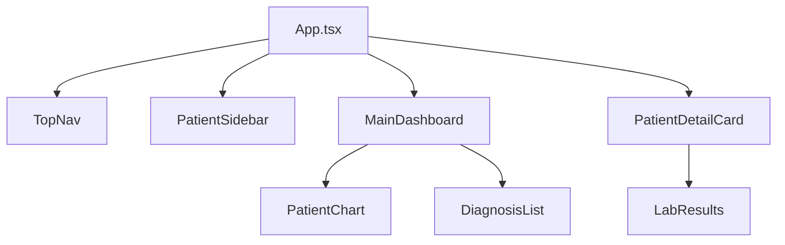
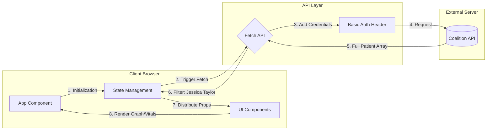

# Patient Data Dashboard 🩺

**A high-fidelity healthcare analytics platform built for the Coalition Technologies Front-End Developer Challenge.**

[](https://ct-patient-data-dashboard.vercel.app)
[](https://github.com/salonyranjan/ct-patient-data-dashboard)

## 🚀 Live Application
View the production build here: **[ct-patient-data-dashboard.vercel.app](https://ct-patient-data-dashboard.vercel.app)**

---

## 📖 Project Overview
This project is a pixel-perfect conversion of a professional Adobe XD healthcare template. It integrates the Coalition Technologies Patient Data API to provide real-time monitoring of patient vitals, diagnosis history, and lab results.

### ✨ Key Features
- **Dynamic Data Filtering:** Optimized to display comprehensive records for **Jessica Taylor**.
- **Interactive Vitals Charting:** Custom-styled **Chart.js** implementation showing Systolic and Diastolic trends with 6-month historical data.
- **Fluid UI/UX:** Enhanced with **Framer Motion** for smooth sidebar transitions and component entries.
- **Responsive Architecture:** A 3-column flexible grid layout that maintains integrity across desktop, tablet, and mobile breakpoints.
- **Modern Styling:** Built with **Tailwind CSS** using custom configuration to match exact Adobe XD hex codes and spacing.

---

## 🏗️ Project Architecture & Workflow

### Component Hierarchy

---

## 🛠️ Tech Stack

| Category | Technology |
|-----------|-------------|
| Framework | React (Functional Components + Hooks) |
| Build Tool | Vite |
| Styling | Tailwind CSS |
| Charts | Chart.js + React Chart.js 2 |
| Animations | Framer Motion |
| Icons | Lucide React |

---
## 🔄 Data Flow Diagram


---
## ⚙️ Local Setup
Clone & Install:

```PowerShell
git clone [https://github.com/salonyranjan/ct-patient-data-dashboard.git](https://github.com/salonyranjan/ct-patient-data-dashboard.git)
cd ct-patient-data-dashboard
npm install --legacy-peer-deps
```
Environment Configuration:
Create a .env file in the root directory:
```bash
Code snippet
VITE_API_URL=[https://fedskillstest.coalitiontechnologies.workers.dev](https://fedskillstest.coalitiontechnologies.workers.dev)
VITE_API_USERNAME="coalition"
VITE_API_PASSWORD="skills-test"
```
Development Mode:

```PowerShell
npm run dev
```
---
## 📁 Folder Structure

| Path                                   | Description                                                  |
| -------------------------------------- | ------------------------------------------------------------ |
| `src/App.tsx`                          | Main application logic, data fetching, and layout rendering. |
| `src/components/PatientSidebar.tsx`    | Patient list and selection sidebar.                          |
| `src/components/TopNav.tsx`            | Navigation bar with doctor info and app controls.            |
| `src/components/PatientDetailCard.tsx` | Patient info card showing personal and insurance details.    |
| `src/components/PatientChart.tsx`      | Chart.js component for displaying blood pressure history.    |
| `src/components/Spinner.tsx`           | Loading screen component.                                    |
| `tailwind.config.js`                   | Tailwind custom theme configuration.                         |

---


